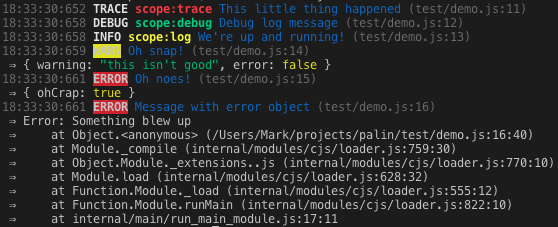

# Palin
> Palin is a beautiful [Bristol](https://github.com/TomFrost/Bristol) formatter for development logging.

[](https://travis-ci.org/MarkHerhold/palin)

## Preview


## Use
Install with `npm install palin --save`

```js
var log = require('bristol');
var palin = require('palin');
log.addTarget('console').withFormatter(palin);

log.info("We're up and running!");
```

One of Palin's main features is the ability to log whatever you throw at it. For example, you may want to log two Errors and other associated data.
```js
var err1 = new Error('Error 1');
var err2 = new Error('Error 2');
log.error('oh, snap!', err1, err2, [ 'thing', 123 ])
```
Produces:
```
23:00:46:035 ERROR oh, snap! (test/integration.js:16)
  →  { '0': 'thing', '1': 123 }
  →  Error: Error 1
  →      at Object.<anonymous> (/Users/Mark/projects/palin/test/integration.js:14:12)
  →      at Module._compile (module.js:425:26)
  →      at Object.Module._extensions..js (module.js:432:10)
  →      at Module.load (module.js:356:32)
  →      at Function.Module._load (module.js:313:12)
  →      at Function.Module.runMain (module.js:457:10)
  →      at startup (node.js:138:18)
  →      at node.js:974:3
  →  Error: Error 2
  →      at Object.<anonymous> (/Users/Mark/projects/palin/test/integration.js:15:12)
  →      at Module._compile (module.js:425:26)
  →      at Object.Module._extensions..js (module.js:432:10)
  →      at Module.load (module.js:356:32)
  →      at Function.Module._load (module.js:313:12)
  →      at Function.Module.runMain (module.js:457:10)
  →      at startup (node.js:138:18)
  →      at node.js:974:3
```

## API

### Formatter Options
As per the Bristol logger API, you may specify options for formatters.

```js
log
  .addTarget('console')
  .withFormatter(palin, {
    // formatter options go here
  });
```

#### Root Folder
Palin logs the file path where log messages originate from. Usually these paths are needlessly long. The `rootFolderName` option allows you to specify a string prefix of where to shorten the path.

```js
log
  .addTarget('console')
  .withFormatter(palin, {
    rootFolderName: 'MyProject'
  });
  // produces log messages like:
  //  08:54:25:892 LOG hello (controller/hello.js:9)
  // instead of:
  //  08:54:25:892 LOG hello (/Users/Mark/projects/MyProject/controller/hello.js:9)
```

#### Timestamp
Palin logs timestamps in the "HH:mm:ss:SSS" format by default. You may want your timestamps to be different. This can be controlled with the `timestamp` option.

You can disable timestamps:
```js
log
  .addTarget('console')
  .withFormatter(palin, {
    timestamp: false
  });
```

You can also provide your own timestamp function (shown with [Moment.js](https://github.com/moment/moment)):
```js
var moment = require('moment'); // using moment.js
log
  .addTarget('console')
  .withFormatter(palin, {
    timestamp: function(date) {
        return moment(date).format(); // produces moment's default format
    }
  });
```

#### Indent
Any information that is attached to a log message is indented and included on the next line. The indentation format can be controlled with the `indent` option.

```js
log
  .addTarget('console')
  .withFormatter(palin, {
    indent: '\n    ⇒  '
  });
```

## Other features
Palin supports the concept of a "scope", which is a way of labeling groups of log messages. To use this, simply add an object with the key `scope` to the list of arguments. The color of the scope variable will be maintained for the lifetime of the the Bristol logger.

```js
log.info('hello world', { scope: 'welcome' });
// produces:
// 08:54:25:892 INFO controller welcome (controller/hello.js:9)
```
